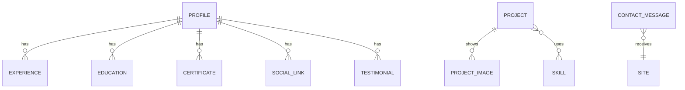
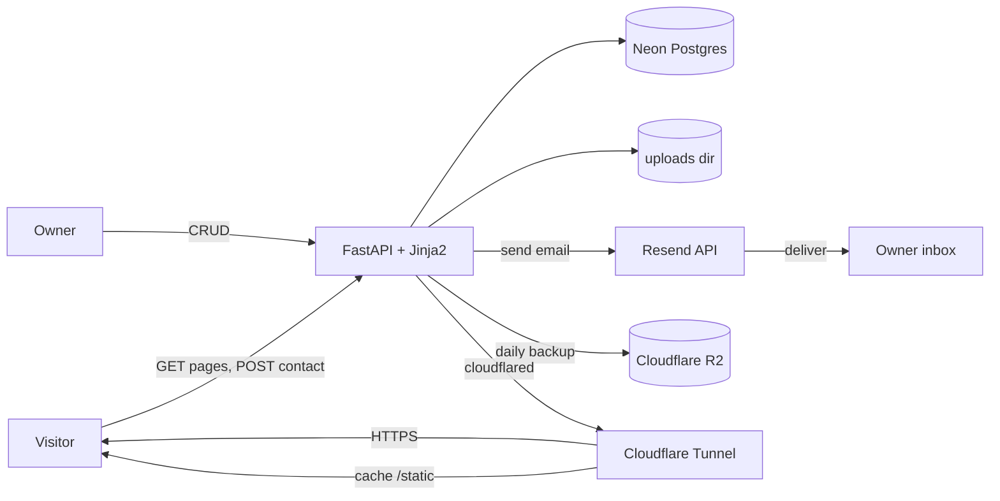

# Portfolio Site — Requirements

Status: FINAL — all decisions confirmed (design Option A, Cloudflare Web
Analytics on, hosting mode A: PC primary + Neon Postgres + R2 backups).

Owner: Mohammed Alhariri — moh.alhariri369@gmail.com — github.com/alhariri369
Domain: hariri-dev.com (Cloudflare DNS + Tunnel)
Audience: first freelance client / first job. Languages: English (default) + Arabic.

## 1. Goal

A fast, calming portfolio that proves backend ability: real experience, real
projects, a working contact form, own domain over HTTPS, and content the owner
can edit without touching code.

## 2. Stack & tooling (final)

| Layer     | Choice                                          | Why                                                              |
| --------- | ----------------------------------------------- | ---------------------------------------------------------------- |
| Backend   | FastAPI + sync SQLAlchemy 2.0                   | async adds nothing at this traffic; sync keeps SQLAdmin trivial  |
| Templates | Jinja2                                          | server-rendered HTML, no JS framework, no build step             |
| Database  | Postgres — Neon free tier (prod), SQLite (dev)  | device-independent; no pause like Supabase; same models on both  |
| Admin     | SQLAdmin                                        | free, FastAPI-native CRUD UI over the same models the site reads |
| Email     | Resend                                          | verified domain hariri-dev.com, free tier 100/day                |
| Fonts     | Manrope + IBM Plex Sans Arabic + JetBrains Mono | Latin, Arabic, mono accents                                      |
| Server    | uvicorn in Docker                               | single container                                                 |
| Hosting   | Linux Mint PC + Docker Compose + cloudflared    | apex via tunnel; may reuse existing terminal.* tunnel            |
| Analytics | Cloudflare Web Analytics                        | no cookies, no extra container                                   |
| Backup    | Cloudflare R2 (free tier) + boto3               | daily pg_dump + uploads tar, keep last 30                        |
| Supabase  | DROPPED — client approved local DB              |                                                                  |

## 3. Boundaries

In scope: public pages EN+AR, contact form, admin panel, seed data, SEO.
Out of scope: user accounts, blog, comments, realtime, CMS beyond SQLAdmin,
fake testimonials, dark mode (v2 candidate), payments, CI/CD, serverless
hosting (Vercel/Netlify — the app is a long-running FastAPI process, not
functions).

- "Static": pages are plain server-rendered HTML (Django-style), no client-side
  app. True static hosting is out — the contact form and admin need a server.
- No auth anywhere on public pages.
- `/admin` is protected by one Basic Auth password from env — a key, not accounts.
- Anti-spam: honeypot + time-gate + per-IP rate limit (3/hour). No CAPTCHA.
- CSRF out of scope: the form has no privileged side effects; abuse is spam,
  which the rate limit + honeypot cover.

## 4. Entities (final)

All user-facing text columns exist twice: `*_en` and `*_ar`.

| Entity              | Fields                                                                                                                                          |
| ------------------- | ----------------------------------------------------------------------------------------------------------------------------------------------- |
| profile (singleton) | name, title_en/ar, tagline_en/ar, summary_en/ar, location_en/ar, email, phone, github_url, avatar_url, banner_url, resume_pdf_url, og_image_url |
| skill               | name_en/ar, category, sort_order                                                                                                                |
| experience          | company_en/ar, role_en/ar, location_en/ar, start_date, end_date (null = current), is_current, description_en/ar, sort_order                     |
| education           | institution_en/ar, degree_en/ar, field_en/ar, start_date, end_date, description_en/ar                                                           |
| certificate         | name_en/ar, issuer_en/ar, issue_date, url                                                                                                       |
| project             | slug (unique, shared across langs), title_en/ar, summary_en/ar, description_en/ar, repo_url, live_url, featured, sort_order                     |
| project_image       | project_id, url, alt_en/ar, sort_order                                                                                                          |
| project_skill       | project_id, skill_id (M2M)                                                                                                                      |
| social_link         | platform, url, sort_order                                                                                                                       |
| testimonial         | author_en/ar, role_en/ar, text_en/ar, published                                                                                                 | — hidden: section renders only if ≥1 published exists; seed contains none |
| contact_message     | name, email, subject, body, created_at, is_spam                                                                                                 |

## 5. ERD (final)

`profile` is a singleton row (id = 1).

## 6. DFD (final)

Context:

Level 1 processes:

1. Render page — route reads DB, Jinja2 renders EN or AR template.
2. Handle contact — validate → honeypot → time-gate → rate limit → insert → Resend email → redirect.
3. Admin CRUD — SQLAdmin over SQLAlchemy models; file uploads to uploads dir.
4. Seed — idempotent script loads CV data; safe to re-run.
5. Backup — daily: pg_dump DB + tar uploads → Cloudflare R2, keep last 30.

## 7. Routes (final)

- `GET /` and `GET /ar` — single-page home: hero, about, skills, experience, education, certificates, projects grid, testimonials (conditional), contact form
- `GET /projects/{slug}` and `GET /ar/projects/{slug}` — project detail
- `POST /contact` and `POST /ar/contact` — contact form target
- `GET /sitemap.xml`, `GET /robots.txt`
- `GET /healthz` — Docker healthcheck
- `/admin` — SQLAdmin behind Basic Auth

## 8. i18n

- English default at `/`, Arabic at `/ar`. No cookies.
- Content: bilingual columns. UI strings: `translations/en.json` + `translations/ar.json`.
- RTL: `dir="rtl"` for AR, Arabic font swap, layout mirrors correctly.
- `hreflang` pairs on every page; sitemap lists both languages.
- Arabic copy: build agent translates all seed content; owner reviews.

## 9. Contact pipeline (exact order)

1. Validate (name, valid email, message required; length caps).
2. Honeypot field `website` filled → save with `is_spam=true`, show fake success, no email.
3. Time-gate: form rendered with hidden timestamp; submit < 2s later → spam path.
4. Rate limit: 3 submissions/hour/IP, in-memory → 429 page.
5. Insert `contact_message` row.
6. Resend: from `portfolio@hariri-dev.com` to `moh.alhariri369@gmail.com`, reply-to = visitor's email. Failures logged, row kept.
7. Redirect with `?sent=1` → confirmation shown.

## 10. Design — Option A "Paper & Ink" (confirmed)

- Light only. Warm off-white bg `#FAF9F6`, near-black ink `#1C2430`, muted `#5A6472`, one accent: teal `#2A9D8F`, hairlines `#E5E2DC`.
- Manrope for Latin text, IBM Plex Sans Arabic for Arabic, JetBrains Mono for labels/dates/tech chips.
- Generous whitespace, max-width ~68rem, thin dividers, no gradients, no glass.
- Motion: subtle fade/rise on scroll, honors `prefers-reduced-motion`.
- WCAG 2.1 AA, contrast ≥ 4.5:1, focus states, skip link.
- Section order: hero → about → skills → experience → education → certificates → projects → testimonials (conditional) → contact.
- Hero: avatar, name, title, tagline, CTAs (Contact, GitHub, resume PDF).
- Flagship: the Graduation Projects Platform is the featured project.
- Option B (same + dark mode toggle) = v2 candidate. Option C (glass/gradients) = rejected.

## 11. SEO

Semantic HTML5; unique title + meta description per page and language; canonical;
hreflang; OG + Twitter cards; JSON-LD Person + WebSite; sitemap with EN+AR URLs;
robots.txt; images WebP, explicit dimensions, alt text, lazy except hero; favicon;
long cache headers on `/static` (Cloudflare caches it).

## 12. Performance, ops & disaster recovery

- LCP < 2.5s; no render-blocking third-party scripts (fonts via Google Fonts + preconnect).
- Docker Compose: app + cloudflared + backup. Volume `./data` (uploads only — the DB is Neon Postgres).
- Healthcheck on `/healthz`, `restart: unless-stopped`.
- Portability: the whole deployment is one compose file + `./data` + `.env`.
  Any Linux host can run it; the tunnel token moves with `.env`; the DB URL
  is just an env var, so the VPS migration touches nothing.
- Backups: daily `pg_dump` of the Neon DB + tar of uploads → Cloudflare R2
  (free tier), keep last 30.
- Restore runbook in README: fresh host → clone → `.env` → download latest
  uploads backup into `./data` → compose up. Target: under 1 hour. The DB
  needs no restore — it was never on the device.
- Hosting mode: CONFIRMED (A) — PC as primary, downtime accepted if the PC
  dies; VPS path documented. Owner already runs a Cloudflare tunnel for
  `terminal.hariri-dev.com`; the portfolio may reuse that tunnel by adding
  the `hariri-dev.com` ingress in the Zero Trust dashboard (apex CNAME to the
  tunnel is standard), or run its own cloudflared container — same result.
- Neon free tier: autosuspend after ~5 min idle, wake ≈1s, no week-long
  pause (unlike Supabase free). No keep-alive needed.

## 13. Seed data (from CV — English; Arabic translated by build agent)

profile: name Mohammed Alhariri; title "Backend Developer"; tagline "Backend
Developer and Information Technology graduate focused on Python, FastAPI, and
database management."; location Yemen; email moh.alhariri369@gmail.com; phone
+967 782 824 717; github https://github.com/alhariri369.

experience (ordered):

1. Freelance Backend Developer — Durrat Tarim, Tarim, Yemen — 2026-02 → 2026-03
   - Developed and deployed a custom web application for a retail client to digitize and manage their daily operations
   - Built the backend using Django and integrated Supabase (PostgreSQL) for secure and reliable data storage
   - Created a responsive UI with Tailwind CSS, working with the client to adjust the design based on feedback
2. Backend Developer, Platform for Managing Graduation Projects — Seiyun University — 2026-01 → 2026-06
   - Built the backend for a proposal-checking and project-archiving platform used by students, supervisors, department heads, and admins end-to-end
   - Quantized an ONNX version of multilingual MiniLM to 8-bit to fit Railway's 1GB RAM limit; semantic similarity search over a FAISS index kept in sync with Supabase via a local SQLite cache
   - Built endpoints comparing a submitted proposal against completed projects and returning similarity scores, paired with Gemini-generated feedback
   - Load-tested the API to confirm 300+ concurrent reads and 10 concurrent writes within Railway's hosting limits; built with FastAPI, SQLAlchemy, and Pydantic, using async where supported
3. Python and Odoo Intern — NOMOW-SOFT, Yemen — 2025-01 → 2025-04
   - Completed a technical training program focused on Python and the basics of Odoo

education:

1. BSc Information Technology — Seiyun University — 2022 → 2026

certificates:

1. Python Developer Certification — freeCodeCamp — 2025-2026
2. Introduction to Generative AI — Google — 2025-2026

skills by category:

- Languages: Python
- Frameworks: FastAPI, Django
- Templating: Jinja2
- Data: SQLAlchemy, Pydantic, PostgreSQL, SQLite, Redis, Supabase
- AI / Vector search: FAISS, MiniLM (ONNX), Cosine Similarity
- DevOps: Docker, Git, GitHub

projects:

1. slug `graduation-projects-platform`, featured: true
   summary: Proposal-checking and project-archiving platform for students, supervisors, and admins.
   description: the 4 experience bullets above. tech: FastAPI, SQLAlchemy, Pydantic, Supabase, FAISS, MiniLM (ONNX), Gemini API. repo/live: null (owner fills).
2. slug `durrat-tarim-retail-app`, featured: false
   summary: Custom retail operations web app that digitizes daily workflows for a local client.
   description: the 3 Durrat Tarim bullets. tech: Django, Supabase, Tailwind CSS. repo/live: null.

social_link: GitHub — https://github.com/alhariri369

## 14. Tests

pytest: contact validation; honeypot → no email; time-gate; rate limit 429;
spam rows flagged; i18n key parity EN/AR; seed idempotency (run twice = same rows).

## 15. README (client requires a full how-to-run)

Prereqs → clone → .env → Neon project + connection string → Resend domain
verification → Cloudflare Tunnel setup (reuse terminal.* tunnel or new one) →
compose up → seed → admin login + change default password → content editing →
backups & disaster recovery (runbook for a dead PC) → troubleshooting (tunnel, email, RTL).
